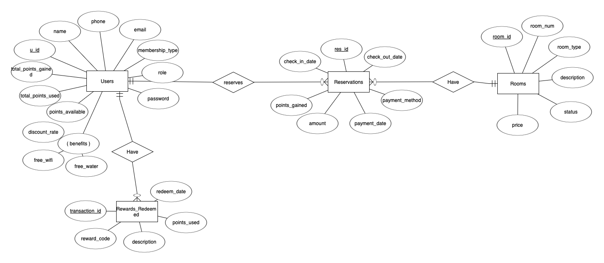
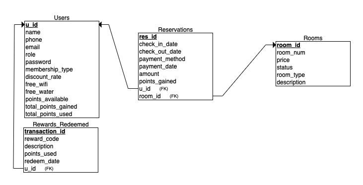

# DataDrivenApplication-Python-MySQL

### Authors
- Isabelle Crow
- Tinovimba Hove

## Narrative 
We developed a __Hotel Reservation System__ to streamline the process of booking, managing, and analyzing hotel reservations. This system is designed to offer a user-friendly experience for both customers and administrators. Key features include real-time room availability tracking, a customer loyalty rewards program, and administrative tools to oversee operations and review analytics.

### Primary Use Cases
- __Managing Hotel Room Bookings__: Facilitate the entire reservation process, from searching for available rooms to confirming bookings.
- __User Management__: Provide tailored access for customers and administrators based on their roles.
- __Room Availability Tracking__: Ensure real-time updates on room status to enable informed booking decisions.
- __Rewards System__: Promote customer loyalty by allowing customers to earn and redeem points for rewards, such as free nights or room upgrades.

### User Roles
- __Admin__:
    - Manage hotel operations, including room inventory and booking statuses.
    - Access analytics via the dashboard to monitor revenue, occupancy rates, and other performance metrics.
- __Customer__:
    - Search for available rooms and make reservations.
    - Earn points for reservations and redeem them for rewards, enhancing customer loyalty and engagement.

## ER Diagram 


## Relational Schema 



## Custom SQL Queries
### Transactional 
These SQL queries support core reservation operations, including availability checks, room status updates, and daily status maintenance:

__Availability Check__

The following query is used to determine whether a room is available for the requested dates:
```{python} 
sql = """
        SELECT COUNT(*) 
        FROM hotel_reservations 
        WHERE room_id = %s AND %s <= check_out_date AND %s >= check_in_date;
        """
```

__Room Status Updates__

Once a reservation is made, we execute two key SQL statements to update the status of the room:

1. Check if a room is currently booked:
```{python}
sql = """
        SELECT COUNT(*) 
        FROM hotel_reservations 
        WHERE room_id = %s AND CURRENT_DATE BETWEEN check_in_date AND check_out_date;
        """
```
*Note: Additional intermediate code has been omitted for clarity.*

2. Update room status after a booking:
```{python}
sql_update = """
        UPDATE hotel_rooms 
        SET status = %s 
        WHERE id = %s;
        """
```

__Daily Status Cleanup__

To ensure the room status remains accurate, this query updates the status of rooms based on the current date:
```{python}
sql = """
        UPDATE hotel_rooms
        SET status = 'Available'
        WHERE id IN (
            SELECT room_id
            FROM reservations
            WHERE CURRENT_DATE > check_out_date
        );
        """
```

### Analytical 
The following SQL statements are integral to the `getReservationStats()` function in the reservations class, providing key insights into booking trends and customer behavior:

__Payment Method Analysis__

To understand the most popular payment methods, we use this query:
```{python}
sql_payment_method = """
        SELECT payment_method, COUNT(*) AS reservation_count
        FROM hotel_reservations
        GROUP BY payment_method
        ORDER BY reservation_count DESC
        """
```

__Reservation Amount Distribution__

This query segments the distribution of reservation amounts into defined ranges:
```{python}
sql_amount_ranges = """
        SELECT 
            CASE 
                WHEN amount <= 1000 THEN '0-1000'
                WHEN amount BETWEEN 1000 AND 2000 THEN '1000-2000'
                ELSE '2000+'
            END AS amount_range,
            COUNT(*) AS total_reservations
        FROM hotel_reservations
        GROUP BY amount_range
        """
```

__Points Earned Per Customer__

To track customer engagement through loyalty points, we run this query:
```{python}
sql_points_gained = """
        SELECT uid, SUM(points_gained) AS total_points
        FROM hotel_reservations
        GROUP BY uid
        ORDER BY total_points DESC
        """
```

__Average Spending by Payment Method__ 

To evaluate spending patterns, we use this query to find the average amount spent per payment method:
```{python}
sql_avg_spending = """
        SELECT payment_method, AVG(amount) AS average_amount
        FROM hotel_reservations
        GROUP BY payment_method
        """
```
